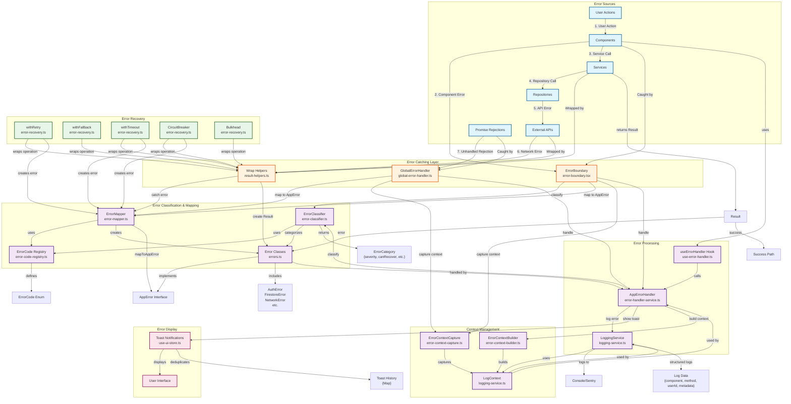
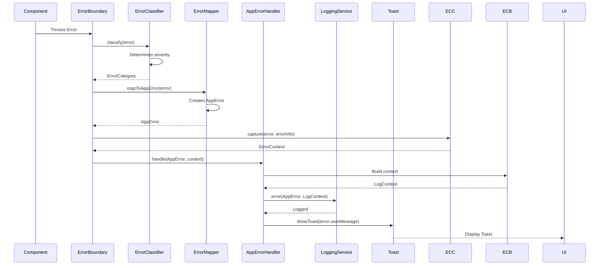
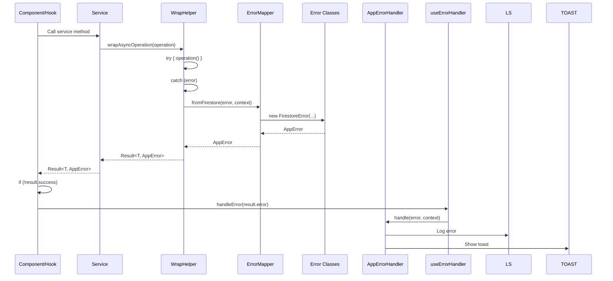
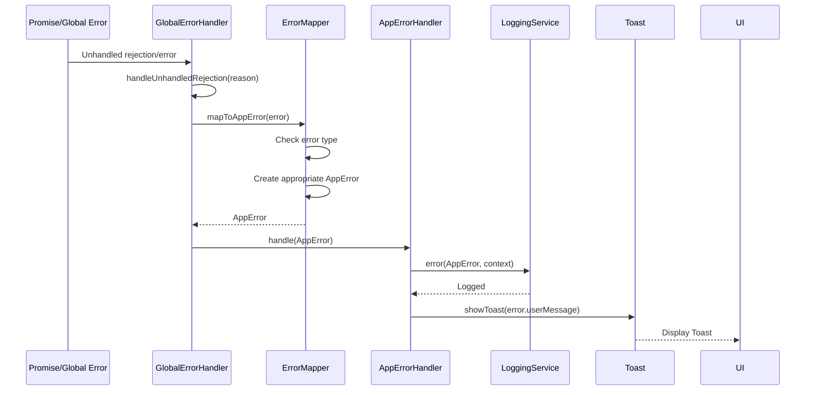
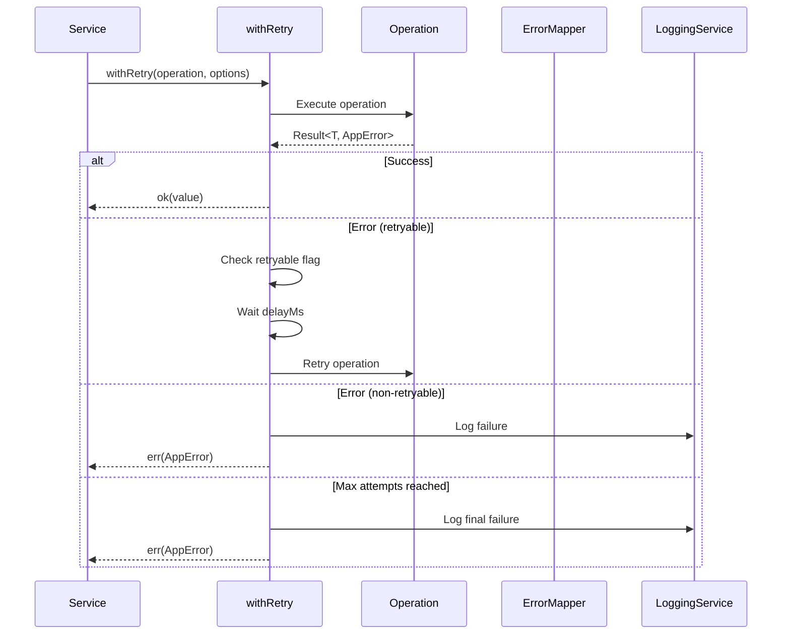
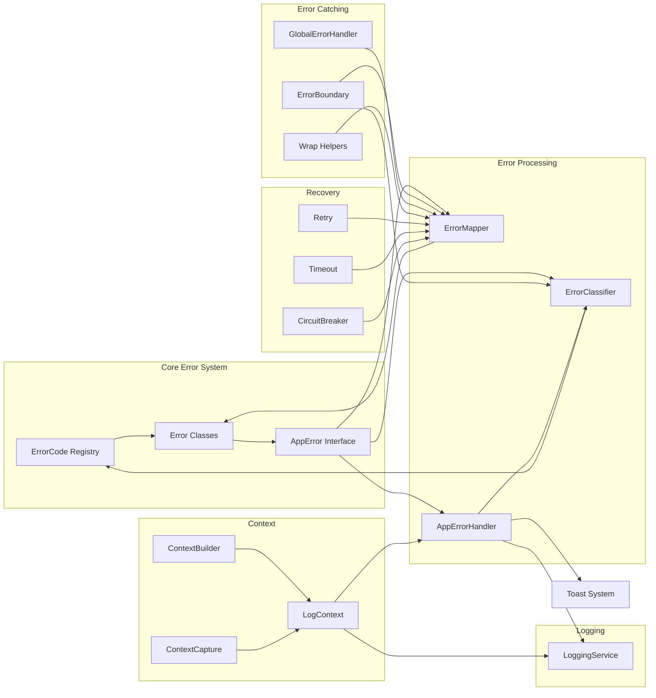
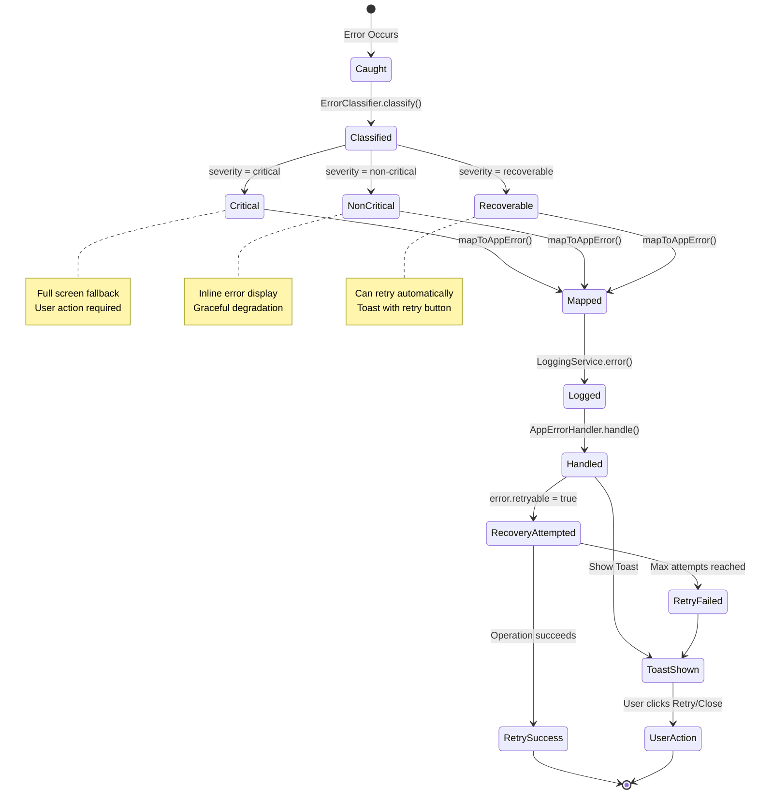
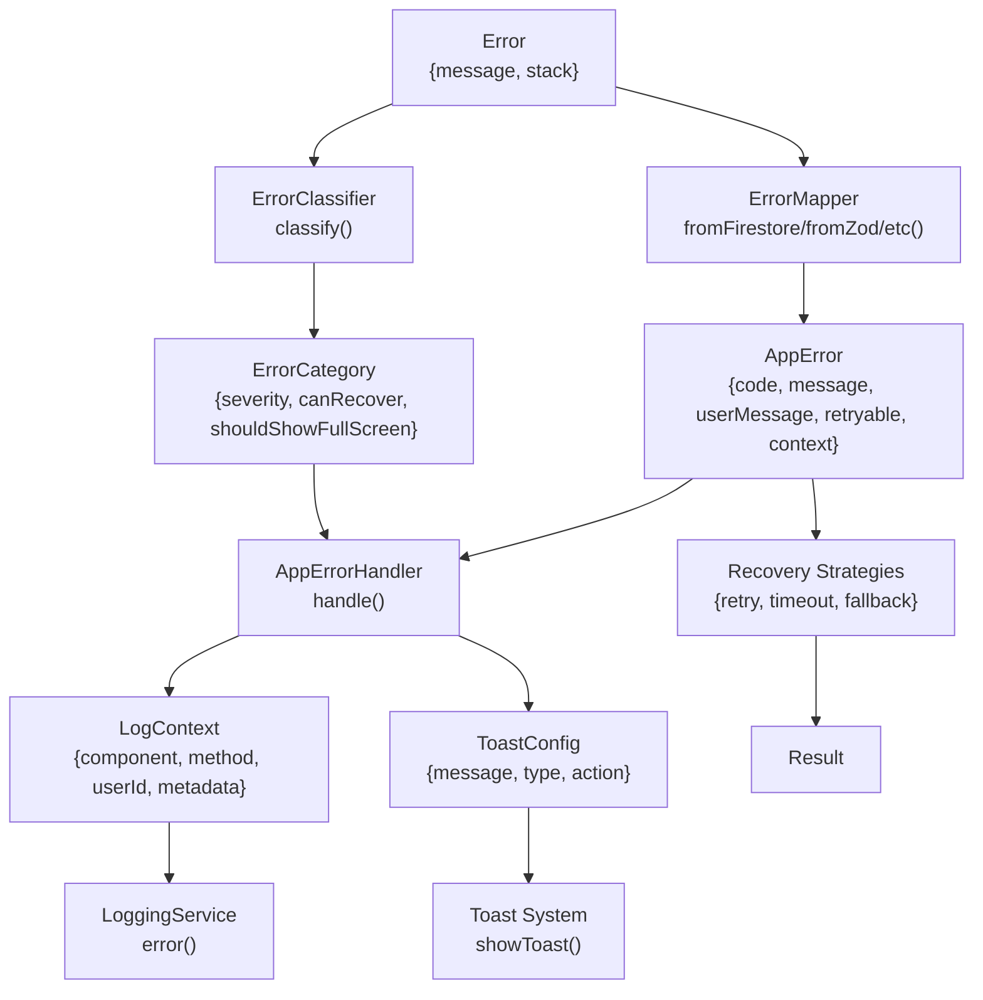
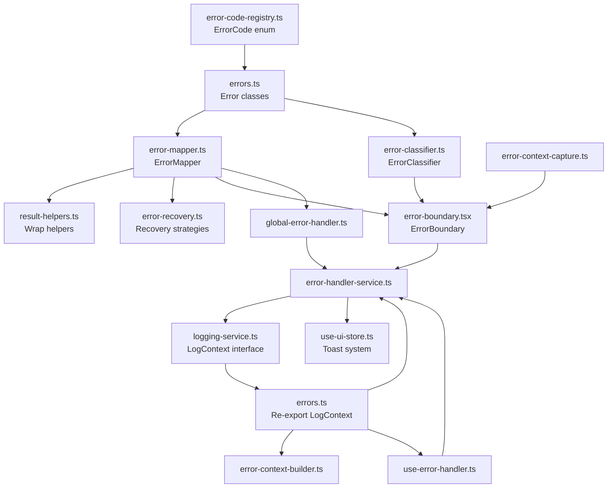

# Error Handling Flow Diagram

This diagram illustrates how errors are caught, processed, classified, logged, and handled throughout the Eye-Doo application.

## Error Flow Sequences

### Sequence 1: Component Error Flow

### Sequence 2: Service Error Flow

### Sequence 3: Global Error Flow

### Sequence 4: Error Recovery Flow

## Component Relationships

## Error State Machine

## Key Relationships Summary

### 1. **Error Sources → Catching**

- Components → ErrorBoundary
- Promises → GlobalErrorHandler
- Services/Repositories → Wrap Helpers

### 2. **Catching → Classification**

- All errors → ErrorClassifier
- ErrorClassifier uses ErrorCode Registry
- Returns ErrorCategory with severity

### 3. **Catching → Mapping**

- All errors → ErrorMapper
- ErrorMapper uses ErrorCode Registry
- Creates appropriate Error Class (AuthError, FirestoreError, etc.)

### 4. **Mapping → Processing**

- AppError → AppErrorHandler
- AppErrorHandler → LoggingService
- AppErrorHandler → Toast System

### 5. **Context Management**

- ErrorContextBuilder → Creates LogContext
- ErrorContextCapture → Captures runtime context
- LogContext → Used by LoggingService and AppErrorHandler

### 6. **Recovery Strategies**

- withRetry → Wraps operations, uses ErrorMapper for timeout errors
- withTimeout → Creates timeout errors via ErrorMapper
- CircuitBreaker → Creates circuit breaker errors via ErrorMapper
- All recovery → Returns Result<T, AppError>

### 7. **Display Layer**

- AppErrorHandler → Toast System (with deduplication)
- Toast System → User Interface
- ErrorBoundary → Inline or Full Screen UI

## Data Flow

## File Dependencies

This diagram shows how all error handling components work together to provide comprehensive error management across your application.
