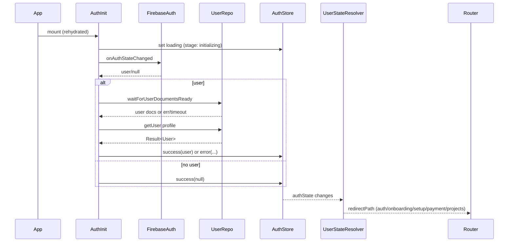

## Global Flow (Auth Init, Routing, Stores)

### Overview

- Covers auth layout, AuthInitializer, auth store, user-state resolution, onboarding/setup/paywall routing.
- Standards referenced: error handling, store patterns, loading states.

### Flow Breakdown

1. App start → `AuthInitializer` sets auth LoadingState and subscribes to Firebase auth.
2. On auth user:
   - Waits for user docs via `waitForUserDocumentsReady`.
   - Loads profile via `userService.getUser`.
   - Writes LoadingState to auth store and clears `_isRegistering`.
   - Subscribes to realtime user updates.
3. On no user: sets `authState` success null.
4. `useUserState` resolves navigation target using `UserStateResolver` (plan, verification, onboarding/setup flags).
5. `app/(auth)/_layout` redirects authenticated users to resolved `redirectPath`; otherwise shows auth stack.
6. Payment layout always renders, optionally gates with `EmailVerificationModal` when unverified.

### Key Dependencies

- `src/components/auth/AuthInitializer.tsx`
- `src/utils/user-document-waiter.ts`
- `src/utils/navigation/user-state-resolver.ts`
- `src/stores/use-auth-store.ts`
- `src/hooks/use-user-state.ts`

### Findings & Fixes

- **Critical – Safety timeout can flip state to error after successful init**  
  `AuthInitializer` starts a 30s safety timeout but never clears it when initialization succeeds; timeout may still fire and overwrite a valid `success` auth state with an error, ejecting users mid-session.

  ```50:70:src/components/auth/AuthInitializer.tsx
  const safetyTimeoutId = setTimeout(() => {
    if (!isMountedRef.current) return;
    const currentState = getAuthState();
    if (currentState.status === 'loading') {
      setAuthState(error(timeoutError, null));
      setIsRegistering(false);
    }
  }, TIMEOUT_CONSTANTS.AUTH_OPERATION);
  ```

  **Fix:** Clear the timeout immediately on any terminal path (success, handled error, or unsubscribe) to avoid late firing.

- **Critical – Onboarding hook uses undefined setter**  
  `useOnboarding` calls `setUser(refreshedUser.value)` but no such setter is defined/imported, causing runtime crash when onboarding completes (affects FREE, BASIC, PRO, STUDIO onboarding).

  ```107:133:src/hooks/use-onboarding.ts
  if (refreshedUser.success) {
    setUser(refreshedUser.value); // setUser not defined in scope
  }
  ```

  **Fix:** Use auth store action `setAuthState(success(user))` or a dedicated setter; ensure import and memoized action per store standards.

- **Major – Missing deduped loading/error clearing in AuthLayout**  
  `_layout` uses `useAuthLoading` only; it ignores `authState.stage === 'initializing'` and `authState.error`, so an initialization error yields an empty stack instead of error UI.

  ```17:26:src/app/(auth)/_layout.tsx
  const isLoading = useAuthLoading();
  if (isLoading || stateLoading) return <LoadingIndicator />;
  ```

  **Fix:** Pass `authState` into a `Screen`/error surface or redirect to an error screen when `authState.status === 'error'`; include stage-aware loading (`authState.stage`).

- **Minor – Registration flag may stick on unrecoverable errors**  
  Safety timeout path sets `_isRegistering` false, but other unexpected exceptions in `onAuthStateChanged` fall through without clearing the flag, potentially gating navigation.  
  **Fix:** In all catch/return branches ensure `setIsRegistering(false)` is called.

### Testing Checklist

- Sign up then wait >30s to confirm auth state is not flipped to error after success.
- Force document waiter timeout (simulate slow Cloud Function) and ensure timeout cleared on success paths.
- Complete onboarding (any plan) and verify no crash; auth store updated with refreshed user.
- Simulate auth init error and confirm user sees error UI (not blank).

### Mermaid (Global Auth & Routing)


