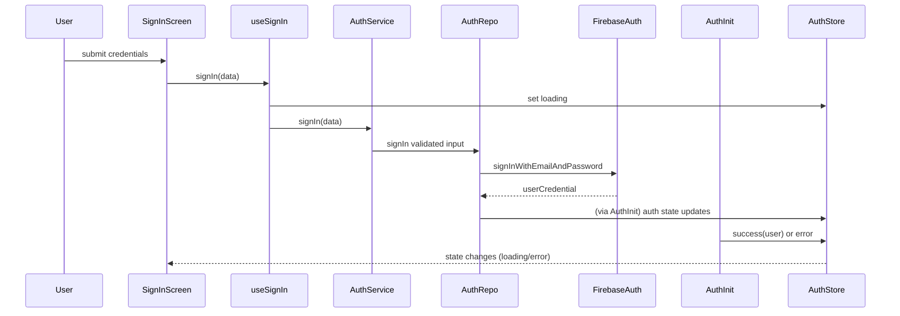

## Sign-In Flow

### Overview

- Screens: `src/app/(auth)/sign-in.tsx`
- Hooks: `useSignIn` (`src/hooks/use-auth-actions.ts`)
- Services/Repo: `authService.signIn`, `FirestoreAuthRepository.signIn`
- Standards referenced: error handling, loading-state, store patterns.

### Flow Breakdown

1. User submits form → `signIn(data)` from `useSignIn`.
2. Hook sets local and global `authState` to `loading`.
3. `authService.signIn` validates input, rate-limits, delegates to repo.
4. Repo signs in with Firebase Auth and fetches Firestore user, updating last login.
5. AuthInitializer (separate listener) completes profile fetch and updates auth store; routing handled by layout.

### Findings & Fixes

- **Major – Unmapped thrown errors in hook catch**  
  Catch block casts to `AppError` without mapping/context; non-AppError exceptions (Stripe/native) bypass standards and surface raw errors.

  ```172:180:src/hooks/use-auth-actions.ts
  } catch (error) {
    const appError = error as AppError; // not mapped
    const errorValue = errorState(appError, getCurrentData(currentAuthState));
    setState(errorValue);
    setAuthState(errorValue);
  }
  ```

  **Fix:** Use `ErrorMapper.toAppError(error, ErrorContextBuilder.fromHook('useSignIn','signIn'))` before writing state/handling.

- **Major – No error clear/retry path in screen**  
  Sign-in screen passes `error` to `Screen` but omits `onRetry`/clear, so once an error occurs the error surface cannot be dismissed or retried per standards.

  ```52:83:src/app/(auth)/sign-in.tsx
  <Screen loading={isLoading} error={error} scrollable ...>
    ...
  </Screen>
  ```

  **Fix:** Provide `onRetry={clearError}` from hook, or route `Screen` retry to re-submit last attempt/clear LoadingState error.

- **Minor – Loading flag may double-count**  
  `isLoading = loading || isInitializing` mixes local mutation loading with global auth init; during background auth refresh, UI may block form needlessly. Evaluate UX; optionally separate mutation loading from global init stage.

### Testing Checklist

- Invalid credentials → error toast surfaces, retry clears error and allows new submission.
- Simulate thrown non-AppError in repo (network) → verify mapped AppError with userMessage and context.
- Background auth refresh while idle → form remains usable.

### Mermaid (Sign-In)


