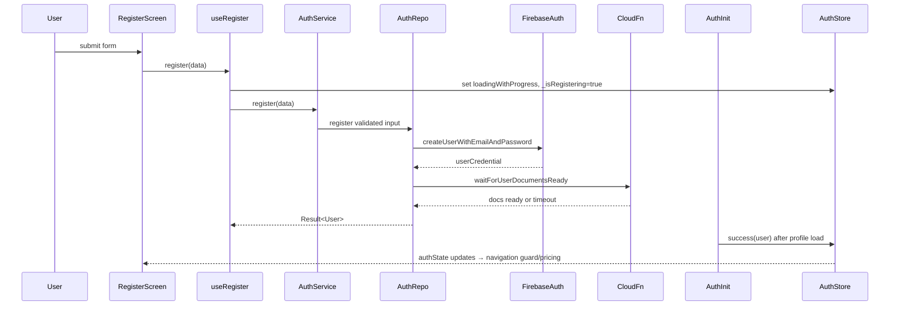

## Register Flow

### Overview

- Screen: `src/app/(auth)/register.tsx`
- Hook: `useRegister` (`src/hooks/use-auth-actions.ts`)
- Services/Repo: `authService.register`, `FirestoreAuthRepository.register`
- Standards referenced: error handling, loading-state, store patterns.

### Flow Breakdown

1. User submits form → `register(data)` from `useRegister`.
2. Hook sets `_isRegistering=true`, sets global `authState` to `loadingWithProgress` (stage “Creating account…”).
3. `authService.register` validates input, rate-limits, delegates to repo.
4. Repo creates Firebase user, sends verification email, waits for Cloud Function to create user docs, then returns user.
5. AuthInitializer listens for Firebase auth change, waits for docs (again), loads profile, and clears `_isRegistering`.
6. Screen uses `LoadingStateDisplay` on `authState`; on success it attempts to route to pricing if `user` exists.

### Findings & Fixes

- **Critical – Onboarding completion crash (shared)**  
  `useOnboarding` invoked post-registration (via onboarding screens) still calls undefined `setUser`, causing crash when onboarding finishes; blocks new users completing flow.

  ```107:133:src/hooks/use-onboarding.ts
  if (refreshedUser.success) {
    setUser(refreshedUser.value); // undefined
  }
  ```

  **Fix:** Replace with auth store setter (`setAuthState(success(user))`) or exported setter; map errors via `ErrorMapper`.

- **Major – Pricing redirect depends on stale `user`**  
  Register screen navigates to pricing only when `success && user`; but `user` from store is still `null` until AuthInitializer updates, so navigation frequently never fires even though registration succeeded.

  ```49:59:src/app/(auth)/register.tsx
  const success = await register(data);
  if (success && user) router.replace(NavigationRoute.PRICING);
  ```

  **Fix:** Use `onSuccess` callback of `useRegister` or listen to auth state transition (authState success) instead of immediate user check; or push pricing once `_isRegistering` true and authState transitions to success.

- **Minor – LoadingStateDisplay retry is a no-op**  
  `onRetry={() => { /* Could add retry logic here */ }}` leaves error recovery empty; users cannot clear errors from registration screen.  
  **Fix:** Wire to a `retryRegister` or `clearError` to align with loading-state standards.

### Testing Checklist

- Registration success triggers navigation to pricing without relying on pre-populated `user`.
- Simulate onboarding completion after registration → no crash; auth store updated.
- Registration error shows retry/dismiss and can be retried without reload.

### Mermaid (Register)


